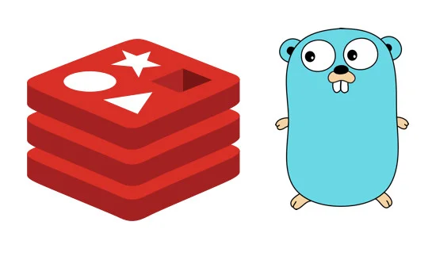

# **GoRedis with Expire Key Notify**



## **Requirements**

- Golang 1.18
- Redis
- Docker
- Frameworks
  - [air](https://github.com/cosmtrek/air)
  - [echo](https://github.com/labstack/echo)
  - [go-redis](https://github.com/redis/go-redis)
  - [RedisInsight](https://github.com/RedisInsight/RedisInsight)

## **Preparation**

### **APIs**

>
> ***Assume Scenario***
>
> Creating simple APIs for checkout an order. If user do nothing within 20 seconds, the service clear the order automatically.
>

#### **POST** - `/checkout`

***`SET` command options***

The SET command supports a set of options that modify its behavior:

- `EX` seconds -- Set the specified expire time, in seconds.
- `PX` milliseconds -- Set the specified expire time, in milliseconds.
- `EXAT` timestamp-seconds -- Set the specified Unix time at which the key will expire, in seconds.
- `PXAT` timestamp-milliseconds -- Set the specified Unix time at which the key will expire, in milliseconds.
- `NX` -- Only set the key if it does not already exist.
- `XX` -- Only set the key if it already exist.
- `KEEPTTL` -- Retain the time to live associated with the key.
- `GET` -- Return the old string stored at key, or nil if key did not exist. An error is returned and SET aborted if the value stored at key is not a string.

In this case, I set expire time if key does not exist (`NX`) via `rdb.SetNX` command :

```go
func Checkout(id string, expire int64) ResponseObj {
	res := ResponseObj{
		Status: http.StatusBadGateway,
		Error:  nil,
		Data:   nil,
	}

	if expire < 1 {
		expire = 1
	}

	expireInMinutes := time.Duration(expire) * time.Second
	key := fmt.Sprintf("%s:%s", mainKeyPrefix, id)

	setNxTTL(mainKeyPrefix)

	// Set key value with expire in seconds
	// if the key does not exist
	result, err := rdb.SetNX(ctx, key, id, expireInMinutes).Result()
	if err == redis.Nil {
		errMsg := fmt.Sprintf("'%s' does not exist!", id)
		res.Error = &errMsg
		res.Status = http.StatusBadRequest
	} else if err != nil {
		errMsg := fmt.Sprintf("Checkout error : %s", err.Error())
		res.Error = &errMsg
		res.Status = http.StatusBadRequest
	} else {
		msg := fmt.Sprintf("Set checkout ID : %v", result)
		res.Data = &Info{Value: msg}
		res.Status = http.StatusOK
	}

	return res
}
```

Create order and set expire :

```sh
curl --location 'http://localhost:1323/checkout' \
--header 'Content-Type: application/json' \
--data '{
    "id": "bf4dcf5b-a744-40c7-8f55-bf6481d70df3",
    "expire": 20
}'
```

output:

```json
{
    "status": 200,
    "data": {
        "ttl": 0,
        "value": "Set checkout ID : true"
    },
    "error": null
}
```

#### **GET** - `/checkout/:id`

```go
func GetOrder(keyPrefix string, id string) ResponseObj {
	res := ResponseObj{
		Status: http.StatusBadGateway,
		Error:  nil,
		Data:   nil,
	}

	key := fmt.Sprintf("%s:%s", keyPrefix, id)

	pipe := rdb.Pipeline()
	info := pipe.Get(ctx, key)
	ttl := pipe.Do(ctx, "TTL", key)

	_, errPipe := pipe.Exec(ctx)
	if errPipe != nil {
		result, ttlErr := rdb.Do(ctx, "TTL", key).Result()
		if ttlErr == redis.Nil {
			errMsg := fmt.Sprintf("[GetOrder] Got redis nil in : %s", ttlErr.Error())
			res.Error = &errMsg
			res.Status = http.StatusBadRequest
		} else if ttlErr != nil {
			errMsg := fmt.Sprintf("[GetOrder] Get TTL error : %s", ttlErr.Error())
			res.Error = &errMsg
			res.Status = http.StatusBadRequest
		} else {
			val := fmt.Sprintf("%v", result)
			ttl, _ := strconv.ParseInt(val, 10, 64)
			res.Data = &Info{
				TTL:   ttl,
				Value: convTTLStatusToMsg(ttl),
			}
			res.Status = http.StatusOK
		}
	} else {
		ttlVal, _ := ttl.Int64()
		res.Data = &Info{
			TTL:   ttlVal,
			Value: info.Val(),
		}
		res.Status = http.StatusOK
	}

	return res
}
```

Get order by ID :

```sh
curl --location 'http://localhost:1323/checkout/bf4dcf5b-a744-40c7-8f55-bf6481d70df3'
```

output:

```json
{
    "status": 200,
    "data": {
        "ttl": 17,
        "value": "bf4dcf5b-a744-40c7-8f55-bf6481d70df3"
    },
    "error": null
}
```

### **Redis - Enable Expire Key Notify**

Set config for `notify-keyspace-events` event, please refer to the config options below :

```txt
K     Keyspace events, published with __keyspace@<db>__ prefix.
E     Keyevent events, published with __keyevent@<db>__ prefix.
g     Generic commands (non-type specific) like DEL, EXPIRE, RENAME, ...
$     String commands
l     List commands
s     Set commands
h     Hash commands
z     Sorted set commands
t     Stream commands
d     Module key type events
x     Expired events (events generated every time a key expires)
e     Evicted events (events generated when a key is evicted for maxmemory)
m     Key miss events (events generated when a key that doesn't exist is accessed)
n     New key events (Note: not included in the 'A' class)
A     Alias for "g$lshztxed", so that the "AKE" string means all the events except "m" and "n".
```

I using `KEA` :

```go
_, err := rdb.Do(ctx, "CONFIG", "SET", "notify-keyspace-events", "KEA").Result()
```

If you set the config success then subscribe on event `__keyevent@0__:expired` :

```go
pubsub := rdb.PSubscribe(ctx, "__keyevent@0__:expired")
// ...

for {
    msg, err := pubsub.ReceiveMessage(ctx)
    // ...
}
```

To allow the feature run separate from main thread (prevent service stuck in the loop), using `goroutines` :

```go
// To support multi-worker group
wg := &sync.WaitGroup{}

go func(/* ARG & TYPE OF THE PARAMETERS */) {

    // >>>>>> YOUR ROUTINE HERE <<<<<<<

}(/* PARAMETERS */)

// To support multi-worker group
wg.Wait()
```

Example :

```go
func EnableKeyNotify() {
	// this is telling redis to publish events since it's off by default.
	_, err := rdb.Do(ctx, "CONFIG", "SET", "notify-keyspace-events", "KEA").Result()
	if err != nil {
		fmt.Printf("Unable to set keyspace events : %v\n", err.Error())
	} else {
		// this is telling redis to subscribe to events published in the keyevent channel,
		// specifically for expired events
		pubsub := rdb.PSubscribe(ctx, "__keyevent@0__:expired")
		wg := &sync.WaitGroup{}

		go func(redis.PubSub) {
			for {
				msg, err := pubsub.ReceiveMessage(ctx)
				if err != nil {
					fmt.Printf("[PubSub] Error message : %v\n", err.Error())
					break
				}
				fmt.Printf("[PubSub] Keyspace event recieved : %v\n", msg.String())

				// >>>>>> DO SOMETHING HERE AFTER NOTIFIED <<<<<<<
			}
		}(*pubsub)

		wg.Wait()
	}
}
```

### **Main Thread**

In main service, use above modules :

```go
package main

import (
	"net/http"
	"github.com/labstack/echo/v4"
	RedisCache "godis/rediscache"
)

func main() {

	e := echo.New()
	RedisCache.NewGoRedis()
	RedisCache.EnableKeyNotify()

	e.GET("/", func(c echo.Context) error {
		return c.String(http.StatusOK, "Hello, World!")
	})

	e.POST("/checkout", func(c echo.Context) error {
		req := new(RedisCache.ReqCheckout)

		if err := c.Bind(req); err != nil {
			return c.JSON(http.StatusBadRequest, err)
		}

		res := RedisCache.Checkout(req.Id, req.Expire)
		return c.JSON(res.Status, res)
	})

	e.GET("/checkout/:id", func(c echo.Context) error {
		id := c.Param("id")
		res := RedisCache.GetOrder("checkout", id)
		return c.JSON(res.Status, res)
	})

	e.Logger.Fatal(e.Start(":1323"))
}
```

## **Usage**

Start the service via `docker-compose` :

```sh
docker-compose -f docker-compose.dev.yml up --build
```

After that I :

- calling checkout 2-times by the same ID `bf4dcf5b-a744-40c7-8f55-bf6481d70df3`
- waiting for expiring and saw notify
- then calling checkout 2-times by the same ID `bf4dcf5b-a744-40c7-8f55-bf6481d70df3`
- waiting for expiring and saw notify

the console output should look like this :

```sh
# ...

test-go-redis-api-1    |    ____    __
test-go-redis-api-1    |   / __/___/ /  ___
test-go-redis-api-1    |  / _// __/ _ \/ _ \
test-go-redis-api-1    | /___/\__/_//_/\___/ v4.10.2
test-go-redis-api-1    | High performance, minimalist Go web framework
test-go-redis-api-1    | https://echo.labstack.com
test-go-redis-api-1    | ____________________________________O/_______
test-go-redis-api-1    |                                     O\
test-go-redis-api-1    | ⇨ http server started on [::]:1323
test-go-redis-api-1    | Set TTL : false
test-go-redis-api-1    | [PubSub] Keyspace event recieved : Message<__keyevent@0__:expired: checkout:bf4dcf5b-a744-40c7-8f55-bf6481d70df3>
test-go-redis-api-1    | Set TTL : false
test-go-redis-api-1    | [PubSub] Keyspace event recieved : Message<__keyevent@0__:expired: checkout:bf4dcf5b-a744-40c7-8f55-bf6481d70df3>
```